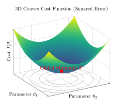

# Chapter 1: Linear Regression & Optimization

**Author:** Suryansh sharma  
**Date:** July 2026

---

## 1. Hypothesis Representation and the Cost Function

To perform supervised learning, we must decide how we are going to represent our hypothesis function $h$ in a computer. As an initial choice, we approximate $y$ as a **linear combination of the input features**, parameterized by the parameter vector $\theta$.

$$ h_\theta(x) = \theta_0 + \theta_1 x_1 + \theta_2 x_2 $$

Here, the $\theta_i$ values are the parameters (also called weights) parameterizing the space of linear functions mapping from $X$ to $Y$. Using vector notation, this equation simplifies to:

$$ h(x) = \sum_{i=0}^{d} \theta_i x_i = \theta^T x $$

Where:
* **$d$** = the total number of features in the dataset.
* **$x$** = the input feature vector, represented by a column matrix of order $(d+1) \times 1$ (assuming an intercept term $x_0 = 1$).
* **$\theta$** = the parameter vector, represented by a column matrix of order $(d+1) \times 1$.

Given a training set, our goal is to pick, or learn, the parameters $\theta$ such that $h(x)$ is as close to $y$ as possible for our training examples. We quantify this **total error** across the entire training set using the **Cost Function** (also called the Objective Function or Loss Function):

$$ J(\theta) = \frac{1}{2} \sum_{i=1}^{n} \left( h_\theta(x^{(i)}) - y^{(i)} \right)^2 $$

While the hypothesis $h_\theta(x)$ is a function of the input data $x$, the cost function $J(\theta)$ is strictly a function of the parameters $\theta$ since the training data $(X, y)$ remains fixed; it is the $\theta$ vector that we manipulate to find the lowest possible value of the cost function. For linear regression, this standard cost function is known as Mean Squared Error (MSE).

## 2. The Geometry of Learning Spaces

To understand the optimization of the loss function, we must understand the different geometric spaces involved in the training process.

### 2.1 Feature Space vs. Parameter Space

The **Feature Space ($\mathcal{F}$)** is a coordinate space whose axes correspond to the input features of the dataset. Every input sample is represented as a point (or vector) in this space, and the training dataset forms a finite subset of the feature space. The feature space remains fixed throughout the training process.

If the input vectors are augmented with a bias feature $x_0=1$, where $\mathcal{X} \subseteq \mathbb{R}^{d+1}$, then each sample is represented as:

$$ x^{(i)} = [1, x_1^{(i)}, \dots, x_d^{(i)}]^T \in \mathbb{R}^{d+1} $$

and the corresponding design matrix is $X \in \mathbb{R}^{n \times (d+1)}$. *(Note: See Appendix A.1 regarding the distinction between input space and feature space).*

The **Parameter Space ($\Theta$)** is a coordinate space whose axes correspond to the model parameters (or weights). Each point in this space represents a unique configuration of the model. During training, the parameter vector moves through the parameter space as the optimization algorithm searches for values that minimize the loss function.

The parameter space is given by $\Theta \subseteq \mathbb{R}^{d+1}$, where a parameter vector can be written as:

$$ \theta = [\theta_0, \theta_1, \dots, \theta_d]^T \in \mathbb{R}^{d+1} $$

The easiest way to separate these spaces is to ask: "What do the coordinates mean?"

| **Property** | **Feature Space (Data World)** | **Parameter Space (Model World)** |
| :--- | :--- | :--- |
| **Concept** | Physical input features of the samples. | Parameters/weights of the model. |
| **Axes** | One specific feature (e.g., $x_1 = \text{Sq. Ft.}$). | One specific weight (e.g., $\theta_1 = \text{Price/Sq. Ft.}$). |
| **Points** | A single training example (one house). | A fully configured model hypothesis. |
| **Dimensions** | $d+1$ dimensions (including $x_0=1$). | $d+1$ dimensions (every feature gets a weight). |
| **Training Dynamics** | Static. Data points act as fixed anchors. | Dynamic. The vector $\theta$ moves to minimize loss. |

### 2.2 The Loss Hypersurface

To find the optimum parameter vector in parameter space, we evaluate every coordinate using the Cost Function $J(\theta)$. Mathematically, $J$ is a mapping from the $(d+1)$-dimensional parameter space to a 1-dimensional scalar cost value: $J: \mathbb{R}^{d+1} \to \mathbb{R}$.

> **Figure 1: Squared Error Loss Hypersurface**

Geometrically, this creates a **Hypersurface** in $\mathbb{R}^{d+2}$ space. If the parameter space is a 2D floor, the loss function creates a 3D mountain range or bowl hovering above it, where altitude represents the error. 

### 2.3 The Gradient Space (The Vector Field)

The gradient operator $\nabla_\theta J(\theta)$ maps a point in the parameter space to a vector that exists *entirely within the same parameter space*: $\nabla_\theta J(\theta): \mathbb{R}^{d+1} \to \mathbb{R}^{d+1}$. The gradient does NOT point up into the 3D bowl (the $(d+2)$-dimensional space of the hypersurface). It is a vector living entirely on the $(d+1)$ floor, pointing toward the coordinates of the steepest uphill path.

## 3. The Least Mean Squares (LMS) & Gradient Descent Algorithm

To minimize the cost function $J(\theta)$, we use a search algorithm that starts with an initial guess for $\theta$ and repeatedly changes $\theta$ to make $J(\theta)$ smaller.

$$ \text{Repeat until convergence: } \left\{ \theta_j := \theta_j - \alpha \frac{\partial}{\partial \theta_j} J(\theta) \quad (\text{for } j = 0, 1, \dots, d) \right\} $$

* **$\theta_j$**: The individual parameter (weight). $\theta_0$ is the bias (y-intercept).
* **$\alpha$ (Learning Rate)**: A positive scalar tuning parameter dictating step size. If $\alpha$ is too small, convergence is slow. If $\alpha$ is too large, the algorithm can overshoot the minimum or diverge.

### 3.1 Types of Gradient Descent

Depending on how much data is used to calculate the gradient at each step, the algorithm is categorized into three types:

1. **Batch Gradient Descent:** Uses the entire dataset to calculate the gradient for a single step. Highly accurate but computationally expensive for massive datasets.
2. **Stochastic Gradient Descent (SGD):** Uses only one random data point to calculate the gradient and update weights. Incredibly fast, but the path to the minimum is noisy and zig-zags wildly.
3. **Mini-Batch Gradient Descent:** The industry standard. Splits data into small groups (e.g., 32, 64, or 128 samples), balancing the speed of SGD with the stability of Batch Gradient Descent.

## 4. The Mechanics of Gradient Descent

The gradient vector follows two rules:
1. **It Points to the Steepest Ascent:** It points in the direction of the steepest increase of the loss function. Therefore, moving in the opposite direction, $-\nabla_\theta J (\theta)$, yields the direction of steepest descent.
2. **Its Length is the Slope:** The magnitude dictates steepness. Far from the minimum, the vector is large (bigger steps). Near the bottom, derivatives shrink toward zero, shortening the vector and preventing overshooting.

### 4.1 The Gradient Vector ($\nabla_\theta J(\theta)$)

The gradient vector packs together all individual partial derivatives of the loss function into a column matrix mirroring the size of $\theta$:

$$
\nabla_\theta J(\theta) = \begin{bmatrix} \frac{\partial J}{\partial \theta_0} \\ \frac{\partial J}{\partial \theta_1} \\ \vdots \\ \frac{\partial J}{\partial \theta_d} \end{bmatrix}_{(d+1) \times 1}
$$

Because matrix operations are element-wise, the simultaneous update loop is a single, elegant vector equation:

$$
\begin{bmatrix} \theta_0 \\ \theta_1 \\ \vdots \\ \theta_d \end{bmatrix}_{\text{new}} := \begin{bmatrix} \theta_0 \\ \theta_1 \\ \vdots \\ \theta_d \end{bmatrix}_{\text{old}} - \alpha \begin{bmatrix} \frac{\partial J}{\partial \theta_0} \\ \frac{\partial J}{\partial \theta_1} \\ \vdots \\ \frac{\partial J}{\partial \theta_d} \end{bmatrix}_{\text{evaluated at } \theta_{\text{old}}}
$$

 

> **Interactive Widget Placeholder: Gradient Descent 3D Visualizer**  
> **Objective:** Create an interactive 3D surface plot of a convex bowl (squared error cost function) to visualize gradient descent.  
> **Inputs:**
> * Learning Rate (Slider)
> * Starting X coordinate (Slider)
> * Starting Y coordinate (Slider)
> * Step/Run Button  
> 
> **Behavior:** Render a 3D convex bowl surface ($z = x^2 + y^2$). Show a point representing the current parameters. When the user clicks step/run, animate the point descending the gradient towards the global minimum (0,0,0) based on the learning rate.

## 5. Mathematical Formulation

### 5.1 The Directional Derivative

Let $v \in \mathbb{R}^{d+1}$ be an arbitrary unit vector ($\|v\| = 1$). The **Directional Derivative** of $J$ at point $\theta$ in the direction of $v$, denoted $D_v J(\theta)$, measures the instantaneous rate of change of the cost function as we move along $v$. By the chain rule:

$$ D_v J(\theta) = \langle \nabla_\theta J(\theta), v \rangle = \nabla_\theta J(\theta)^T v $$

Using the geometric definition of the inner product, where $\phi$ is the angle between the vectors:

$$ D_v J(\theta) = \|\nabla_\theta J(\theta)\| \|v\| \cos(\phi) = \|\nabla_\theta J(\theta)\| \cos(\phi) $$

Since the gradient magnitude $\|\nabla_\theta J(\theta)\|$ is fixed at any given point, the rate of change depends entirely on $\cos(\phi)$:

* **Steepest Ascent:** Maximized when $\cos(\phi) = 1$ ($\phi = 0$). $v$ points in the *exact same* direction as the gradient.
* **Steepest Descent:** Minimized when $\cos(\phi) = -1$ ($\phi = \pi$). $v$ points in the *exact opposite* direction of the gradient.

The optimal direction for minimizing the cost function is strictly $v = -\frac{\nabla_\theta J(\theta)}{\|\nabla_\theta J(\theta)\|}$.

### 5.2 First-Order Taylor Approximation

Taking a small step $\Delta \theta$, the new cost is approximated by the first-order Taylor series:

$$ J(\theta + \Delta \theta) \approx J(\theta) + \nabla_\theta J(\theta)^T \Delta \theta $$

If we define our step as $\Delta \theta = -\alpha \nabla_\theta J(\theta)$, the change in cost becomes:

$$ \nabla_\theta J(\theta)^T (-\alpha \nabla_\theta J(\theta)) = -\alpha \|\nabla_\theta J(\theta)\|^2 $$

Since $\alpha$ and the squared norm are strictly positive, this term is strictly negative, mathematically guaranteeing that taking a step in the direction of the negative gradient strictly decreases the cost function.

## 6. The LMS Algorithm

### 6.1 The Single Training Example (Widrow-Hoff Rule)

Evaluating the gradient for a single training example $(x, y)$, our cost simplifies to $J(\theta) = \frac{1}{2} (h_\theta(x) - y)^2$. Applying the chain rule to a specific parameter $\theta_j$:

$$ 
\begin{aligned} 
\frac{\partial J}{\partial \theta_j} &= \frac{\partial}{\partial \theta_j} \left[ \frac{1}{2} (h_\theta(x) - y)^2 \right] \\ 
&= (h_\theta(x) - y) \cdot \frac{\partial}{\partial \theta_j} \left( \sum_{i=0}^d \theta_i x_i - y \right) \\ 
&= (h_\theta(x) - y) x_j 
\end{aligned} 
$$

Factoring a negative sign out of the residual and substituting the gradient back into the gradient descent algorithm gives the standard LMS update rule:

$$ \theta_j := \theta_j + \alpha \left( y^{(i)} - h_\theta(x^{(i)}) \right) x_j^{(i)} $$

> **Intuition:** The term $(y^{(i)} - h_\theta(x^{(i)}))$ represents pure error. Under-predictions (positive error) increase weight $\theta_j$, while over-predictions (negative error) decrease it. The update magnitude is proportional to the error and the specific feature magnitude $x_j^{(i)}$.

### 6.2 Batch Gradient Descent

This method evaluates every example in the entire training set on every step. To minimize total cost across all $n$ examples, we use the sum of all individual gradients:

$$ \frac{\partial J}{\partial \theta_j} = \sum_{i=1}^{n} (h_\theta(x^{(i)}) - y^{(i)}) x_j^{(i)} $$

Yielding the Batch Gradient Descent algorithm loop:

$$ \text{Repeat until convergence: } \left\{ \theta_j := \theta_j + \alpha \sum_{i=1}^{n} \left( y^{(i)} - h_\theta(x^{(i)}) \right) x_j^{(i)} \quad (\text{for every } j) \right\} $$

### 6.3 Stochastic Gradient Descent

In this algorithm, we repeatedly run through the training set, and each time we encounter a training example, we update the parameters according to the gradient of the error with respect to that single training example only.

$$ 
\begin{aligned}
& \text{Repeat until convergence:} \\
& \quad \text{For } i = 1 \text{ to } n: \\
& \quad \quad \theta_j := \theta_j + \alpha \left( y^{(i)} - h_\theta(x^{(i)}) \right) x_j^{(i)} \quad \text{(for every } j)
\end{aligned}
$$

> **Note 1:** Batch gradient descent has to scan through the entire training set before taking a single step, which is computationally prohibitive for large datasets. SGD, conversely, begins optimizing parameters immediately.  
> **Note 2:** SGD moves $\theta$ "close" to the minimum much faster than batch gradient descent, but it may never truly "converge." The parameters will continue oscillating around the global minimum of $J(\theta)$, though in practice, these values are reasonably good approximations to the true minimum.

## 7. The Normal Equations (Closed-Form Solution)

Gradient descent is an iterative optimization method. Alternatively, we can minimize $J(\theta)$ analytically by explicitly taking its derivatives with respect to the $\theta_j$'s and setting them to zero, finding the minima in a single step using matrix calculus.

### 7.1 Matrix Derivatives Context

To understand how a matrix $A$ relates to a function $f$, we view it through the lens of multivariable calculus. 

**1. Structurally: A Collection of Independent Variables**  
The matrix $A \in \mathbb{R}^{n \times d}$ is a structured grid holding $n \times d$ independent scalar variables. If flattened, it would be a massive vector, but matrix notation preserves the inherent row-and-column relationship of the data.

**2. Geometrically: A Single Location in $\mathbb{R}^{n \times d}$**  
Just as a pair $(x, y)$ represents a point on a 2D plane, the matrix $A$ represents a single coordinate point inside an $(n \times d)$-dimensional space. The function $f(A)$ evaluates this high-dimensional position and calculates a single scalar "altitude" or value.

**3. The Mathematical Relationship**  
The notation $f : \mathbb{R}^{n \times d} \to \mathbb{R}$ indicates the function maps an entire matrix to a single real number. When we ask how tweaking one element $A_{ij}$ changes the output $f(A)$, we use the partial derivative $\frac{\partial f}{\partial A_{ij}}$. Under Gradient Layout Notation, we arrange these derivatives into a matrix matching the exact dimensions of $A$:

$$
\nabla_A f(A) = \begin{bmatrix}  \frac{\partial f}{\partial A_{11}} & \frac{\partial f}{\partial A_{12}} & \cdots & \frac{\partial f}{\partial A_{1d}} \\  \frac{\partial f}{\partial A_{21}} & \frac{\partial f}{\partial A_{22}} & \cdots & \frac{\partial f}{\partial A_{2d}} \\  \vdots & \vdots & \ddots & \vdots \\  \frac{\partial f}{\partial A_{n1}} & \frac{\partial f}{\partial A_{n2}} & \cdots & \frac{\partial f}{\partial A_{nd}}  \end{bmatrix}
$$

### 7.2 The Least Squares Revisited

We group our training inputs into a design matrix $X$ and our targets into a vector $\vec{y}$:

$$ X = \begin{bmatrix} \text{---} & (x^{(1)})^T & \text{---} \\ \text{---} & (x^{(2)})^T & \text{---} \\ & \vdots & \\ \text{---} & (x^{(n)})^T & \text{---} \end{bmatrix}_{n \times (d+1)} , \quad \vec{y} = \begin{bmatrix} y^{(1)} \\ y^{(2)} \\ \vdots \\ y^{(n)} \end{bmatrix}_{n \times 1} $$

Since our hypothesis is $h_\theta(x^{(i)}) = (x^{(i)})^T \theta$, the prediction vector is $X\theta$. Using the vector identity $z^T z = \sum_{i} z_i^2$, we write the cost function cleanly:

$$ J(\theta) = \frac{1}{2} (X\theta - \vec{y})^T (X\theta - \vec{y}) $$

**Algebraic Expansion:**  
Applying the distributive property and the transpose rule $(AB)^T = B^T A^T$:

$$ J(\theta) = \frac{1}{2} \left[ \theta^T (X^T X) \theta - \theta^T X^T \vec{y} - \vec{y}^T X \theta + \vec{y}^T \vec{y} \right] $$

Because $\theta^T X^T \vec{y}$ evaluates to a scalar, it equals its transpose $\vec{y}^T X \theta$. Combining them yields:

$$ J(\theta) = \frac{1}{2} \left[ \theta^T (X^T X) \theta - 2(X^T \vec{y})^T \theta + \vec{y}^T \vec{y} \right] $$

**Matrix Differentiation:**  
We apply the Linear Rule ($\nabla_x (b^T x) = b$) and the Quadratic Rule ($\nabla_x (x^T A x) = 2Ax$ for symmetric $A$):

$$ \nabla_\theta J(\theta) = \frac{1}{2} \left[ 2(X^T X)\theta - 2X^T \vec{y} \right] = X^T X \theta - X^T \vec{y} $$

**Direct Optimization:**  
Setting the gradient vector to zero yields the closed-form Normal Equation:

$$ X^T X \theta = X^T \vec{y} \implies \boxed{\theta = (X^T X)^{-1} X^T \vec{y}} $$

## 8. Probabilistic Interpretation for Least-Squares

Why choose squared error $J(\theta)$? Under specific frequentist assumptions, minimizing squared error is mathematically identical to maximizing the likelihood of observing our training data.

### 8.1 Core Assumptions

We assume targets $y^{(i)}$ and inputs $x^{(i)}$ are related by a linear combination plus an error term $\epsilon^{(i)}$:

$$ y^{(i)} = \theta^T x^{(i)} + \epsilon^{(i)} $$

The error terms $\epsilon^{(i)}$ are assumed to be independently and identically distributed (IID) according to a Gaussian distribution with mean zero and variance $\sigma^2$:

$$ \epsilon^{(i)} \sim \mathcal{N}(0, \sigma^2) $$

The probability density function is:

$$ p(\epsilon^{(i)}) = \frac{1}{\sigma\sqrt{2\pi}} \exp\left( -\frac{(\epsilon^{(i)})^2}{2\sigma^2} \right) $$

### 8.2 Conditional Distribution of $y$

Because $y^{(i)}$ is a deterministic shift of $\epsilon^{(i)}$, its distribution given $x^{(i)}$ is also Gaussian:

$$ y^{(i)} \mid x^{(i)}; \theta \sim \mathcal{N}(\theta^T x^{(i)}, \sigma^2) $$

$$ p(y^{(i)} \mid x^{(i)}; \theta) = \frac{1}{\sigma\sqrt{2\pi}} \exp\left( -\frac{(y^{(i)} - \theta^T x^{(i)})^2}{2\sigma^2} \right) $$

*(Note: We use a semicolon in $p(y^{(i)} \mid x^{(i)}; \theta)$ because $\theta$ is a fixed, deterministic parameter, not a random variable).*

### 8.3 Maximizing Log-Likelihood ($\ell(\theta)$)

The Likelihood Function $L(\theta) = p(\vec{y} \mid X; \theta)$ is the probability of the data given the parameters. By the independence assumption, this is the product of individual probabilities.

Maximum Likelihood Estimation (MLE) dictates we choose a $\theta$ that maximizes $L(\theta)$. Since the logarithm is strictly increasing, we maximize the log-likelihood $\ell(\theta)$ to convert products into summations:

$$ \ell(\theta) = \log \prod_{i=1}^n \frac{1}{\sigma\sqrt{2\pi}} \exp\left( -\frac{(y^{(i)} - \theta^T x^{(i)})^2}{2\sigma^2} \right) $$

$$ \ell(\theta) = n \log \left(\frac{1}{\sigma\sqrt{2\pi}}\right) - \frac{1}{2\sigma^2} \sum_{i=1}^n (y^{(i)} - \theta^T x^{(i)})^2 $$

### 8.4 Connection to Least-Squares

Because the first term is constant and the scaling factor $\frac{1}{2\sigma^2}$ is positive, maximizing $\ell(\theta)$ mathematically reduces to minimizing the remaining summation:

$$ \arg\max_\theta \ell(\theta) = \arg\min_\theta \frac{1}{2} \sum_{i=1}^n (y^{(i)} - \theta^T x^{(i)})^2 $$

This proves that under the assumption of IID Gaussian noise, **Ordinary Least Squares (OLS) regression is structurally identical to Maximum Likelihood Estimation.**

---

## Appendices

### A.1 Difference Between Input Space $\mathcal{X}$ and Feature Space $\mathcal{F}$

Feature transformation, denoted as $\phi$, takes an input vector from the input space and maps it into a feature space: $\phi: \mathcal{X} \to \mathcal{F}$.

* **Input Space ($\mathcal{X}$):** The set of raw inputs provided to the model. Mathematically, $\mathcal{X} \subseteq \mathbb{R}^d$.
* **Feature Space ($\mathcal{F}$):** The set of representation vectors the model actually operates on, obtained via $\phi(x) \in \mathcal{F}$.

**Relationship:**
* If no transformation is applied ($\phi(x) = x$), then $\mathcal{F} = \mathcal{X}$.
* If feature engineering is applied ($\phi(x) \neq x$), then $\mathcal{F} \neq \mathcal{X}$.

**Example:**  
If the input is $x = (\text{Area}, \text{Bedrooms}) \in \mathbb{R}^2$, the input space is $\mathcal{X} \subseteq \mathbb{R}^2$.
If we define a feature map $\phi(x) = (\text{Area}, \text{Bedrooms}, \text{Area}^2, \text{Area} \times \text{Bedrooms})$, the resulting feature space is $\mathcal{F} \subseteq \mathbb{R}^4$. In standard linear regression with raw features, these spaces coincide, making the distinction largely invisible until nonlinear transformations are introduced.

### A.2 Notation Nuances of the Design Matrix

The sample vector $x^{(i)}$ is a true geometric vector in $(d+1)$-dimensional space, but the design matrix $X$ is a standard matrix, not a vector itself.

$$
X = \begin{bmatrix} 1 & x_1^{(1)} & x_2^{(1)} & \dots & x_d^{(1)} \\ 1 & x_1^{(2)} & x_2^{(2)} & \dots & x_d^{(2)} \\ \vdots & \vdots & \vdots & \ddots & \vdots \\ 1 & x_1^{(n)} & x_2^{(n)} & \dots & x_d^{(n)} \end{bmatrix}
$$

Each column represents a single feature, and each row represents a single sample. The notation $\mathbb{R}^{n \times (d+1)}$ can occasionally cause conceptual friction when compared to vector spaces. 

In pure mathematics, the set of all possible $n \times (d+1)$ real matrices is isomorphic to $\mathbb{R}^{n \cdot (d+1)}$. For example, a $100 \times 3$ matrix holds the exact same informational content as a 300-dimensional vector space ($\mathbb{R}^{100 \times 3} \cong \mathbb{R}^{300}$). Writing $\mathbb{R}^{n \times (d+1)}$ is a specialized shorthand indicating that a flat, high-dimensional vector has been deliberately arranged into a grid to permit matrix multiplication and preserve the dataset's row-column semantics.